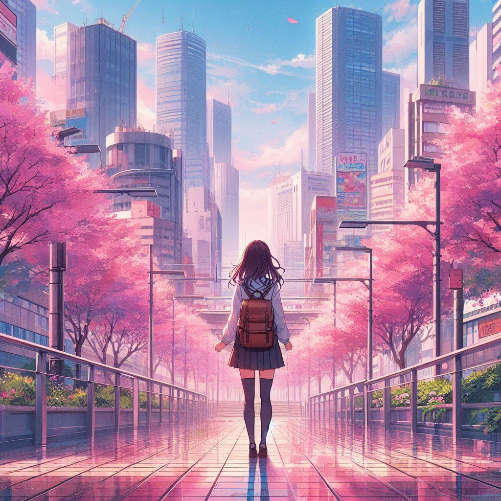
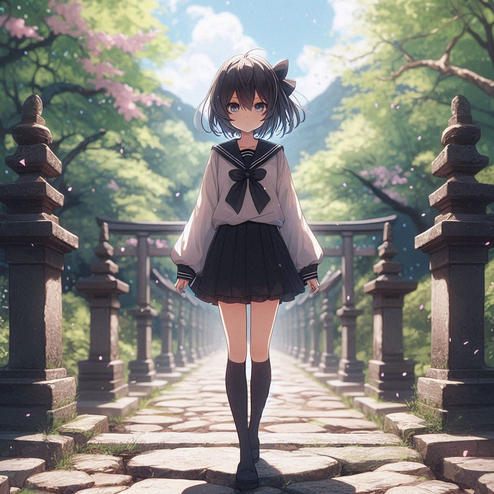
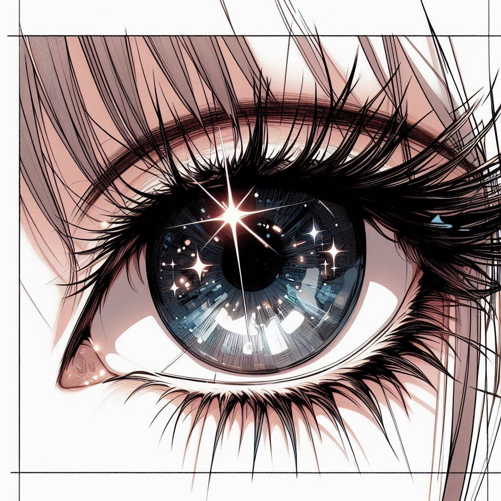
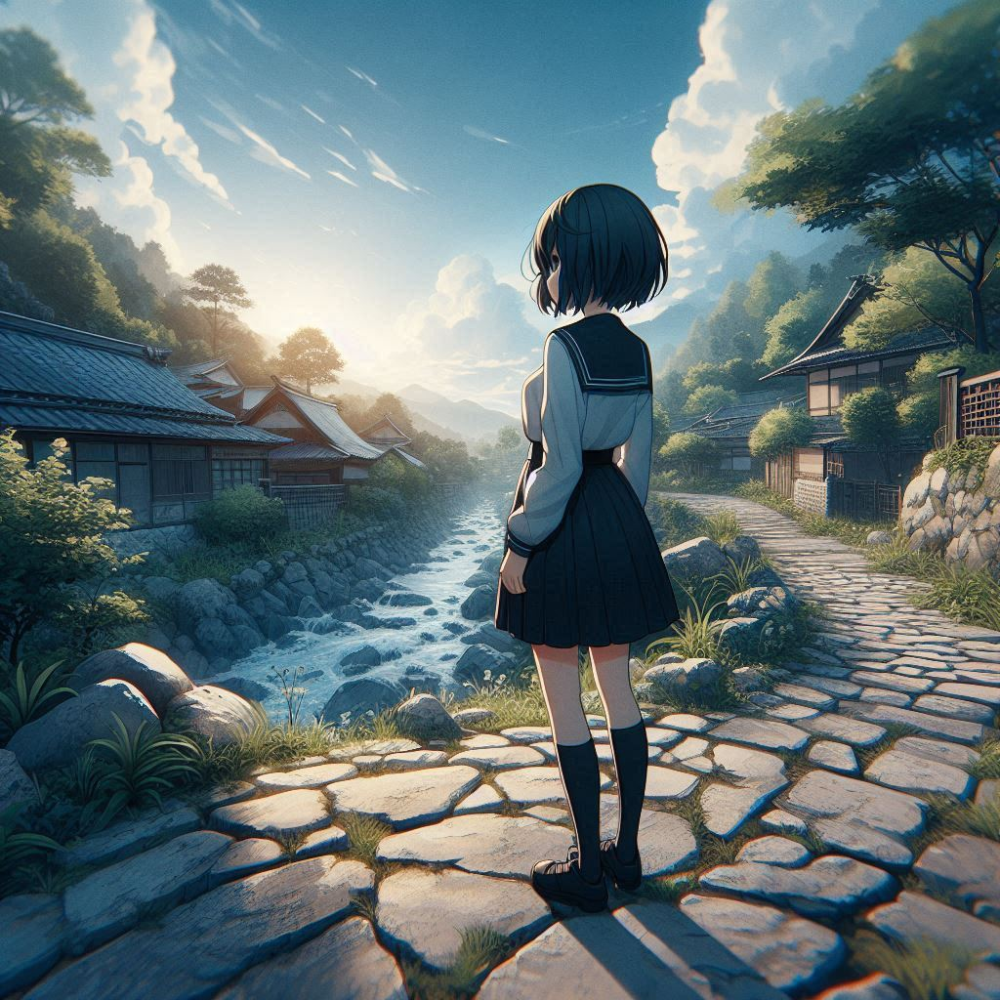

# From beginner to a beginner perhaps !

I am sharing art prompts that are tried in Copilot designer and work in general.

Results that are contrary to the expecations may be observed.

First is basics : create anime art of girl
<blockquote></blockquote>

# Camera modifications:

Camera mod1 : create anime art of girl standing
<blockquote></blockquote>

Camera mod2 : create anime art of girl standing in distance

Camera mod3 : create..... in distance, fullbody (alt: standing on object)
<blockquote></blockquote>

Camera mod4 : create..... standing far away

Camera mod5 : create..... standing very far away

Camera mod6 : create anime art of girl closeup
<blockquote></blockquote>

Camera mod7 : create anime art of girl face closeup
<blockquote></blockquote>

Camera mod8 : create anime art of girl eye closeup
<blockquote></blockquote>

Camera attitude1 : front view (opt: wide angle view)

Camera attitude2 : side view (opt: wide angle view)
<blockquote></blockquote>

Camera attitude3 : from behind

Camera attitude4 : top view / bird's eye view (this does not work properly)

Camera height1 : from above / high angle view (drop in quality)

Camera height2 : from below / low angle view

Camera height3 : from high above (significant drop in quality)

Camera height4 : from very high above (significant drop in quality)

Camera height5 : very low angle view

Camera height6 : at top

Camera height7 : at top, steep fall

Camera height8 : at top, steep fall, deep valley

Camera height9 : at base of...

Camera height10: at base of..., steep rise

# Composition modifications:

Size mod1 : large

Size mod2 : very large / huge

Size mod3 : small

Size mod4 : very small / tiny

Time mod1 : early sunrise

Time mod2 : before sunrise

Time mod3 : sunrise / dawn

Time mod4 : sunny

Time mod5 : afternoon

Time mod6 : sunset / evening

Time mod7 : twilight / after sunset

Time mod8 : dusk

Time mod9 : dark night

# Aesthetics to improve Colors and Composition 

Aesthetics1 : sunny, clear blue sky

Aesthetics2 : sunny, dense bright clouds, blue sky

Aesthetics3 : setting sun

Aesthetics4 : overcast weather, greenery

Aesthetics5 : overcast weather, dense gray clouds, greenery

Aesthetics6 : sunny, tree, dappled sunlight

Aesthetics7 : sunset, tree, dappled sunlight

Aesthetics8 : deep red sunset

Aesthetics9 : sunny, heavy rainfall, rainbow

Aesthetics10: overcast weather, heavy rainfall

Aesthetics11: dark night, stars

Aesthetics12: dark night, bright stars

Aesthetics13: golden hour, bokeh

# AI Building Materials (seperate dedicated repo TBD)

concrete : concrete bench, concrete path, concrete walls, 
concrete steps/stairs, circular concrete window, concrete house,
concrete bridge

stone : stone path, stone walls, stone house, stone ruins

brick : red brick wall (school/old buildings)

path : path, trail, road, narrow/wide road, modern road, forest trail

tree : birch tree, pine tree

grass : fresh grass, dried grass, dried yellow grass, tall grass closeup

rock : anime rock, large rock closeup

hill : hill station, hills in distance

mountain : high mountains, prominent mountain, wide/huge mountain

river : sining river, turbulent river, calm river, clear river, pebbles

pond : small pond, circular pond

lake : vast lake, low angle view, reflections, lonely boat (good for reflections)

# AI Enhancements for Quality improvement

Wet non-reflective/reflective surfaces in general will give better quality output, these can be:

wet road, wet wide modern road

wet stone path

wet terrace/balcony

wet grass

wet railing

