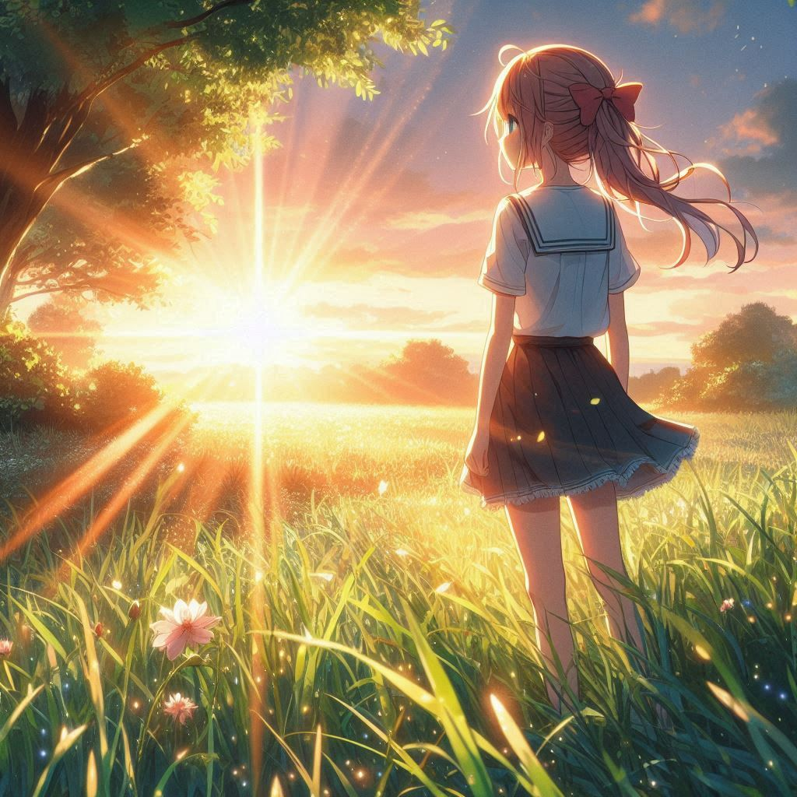
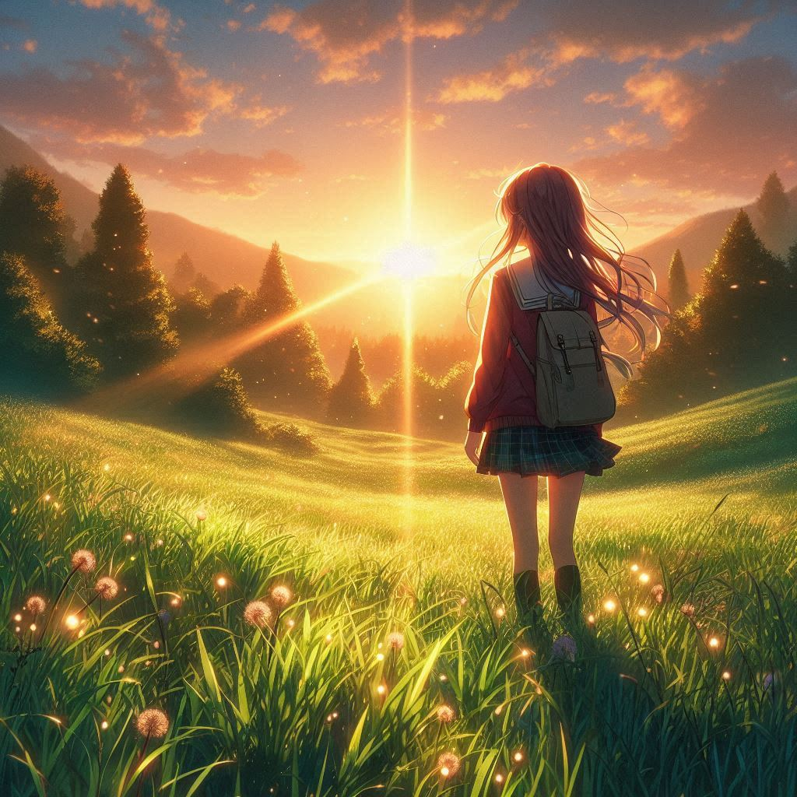
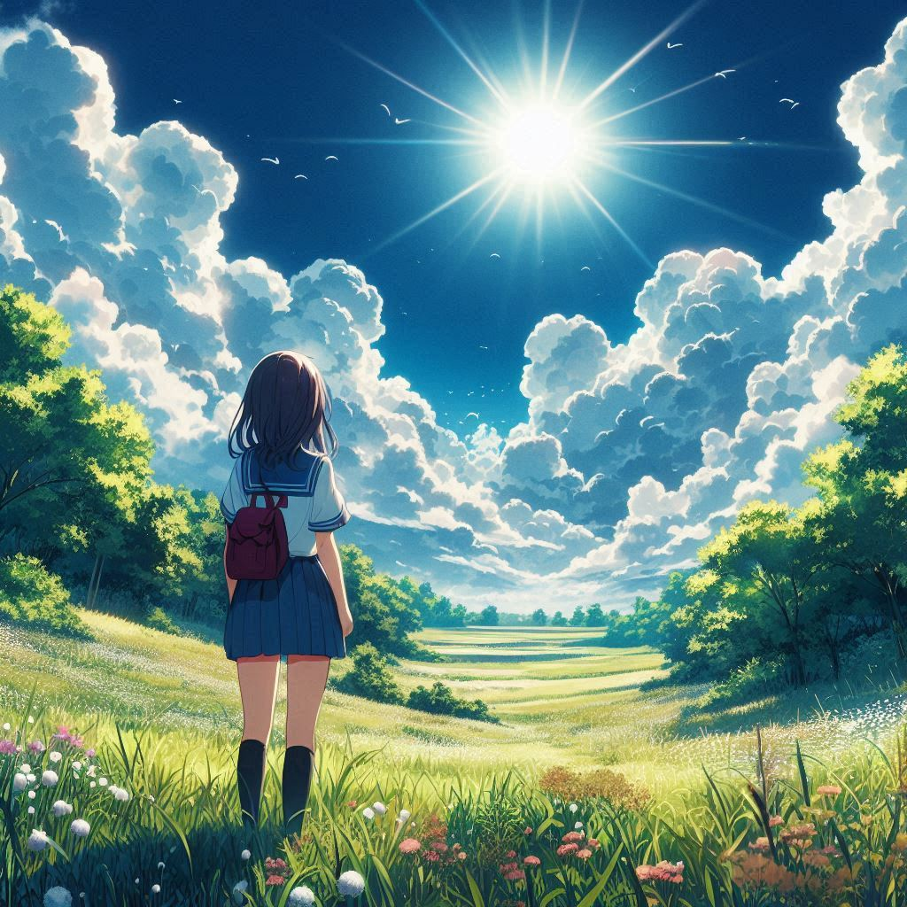
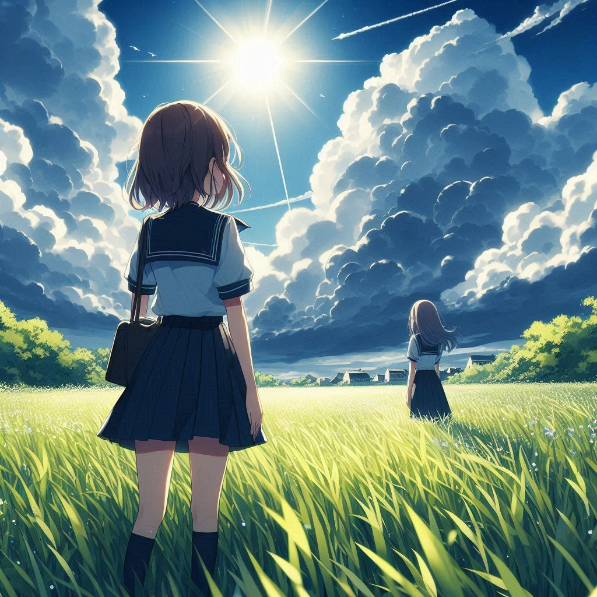
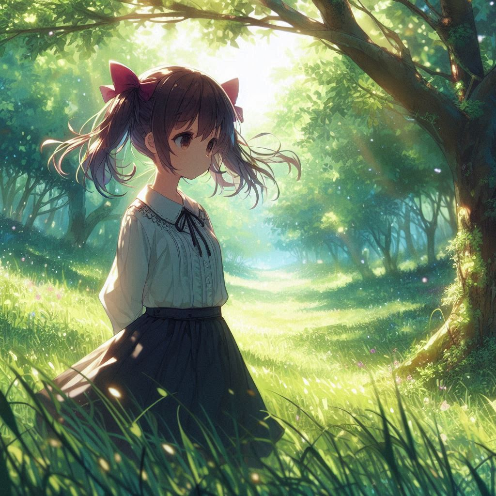
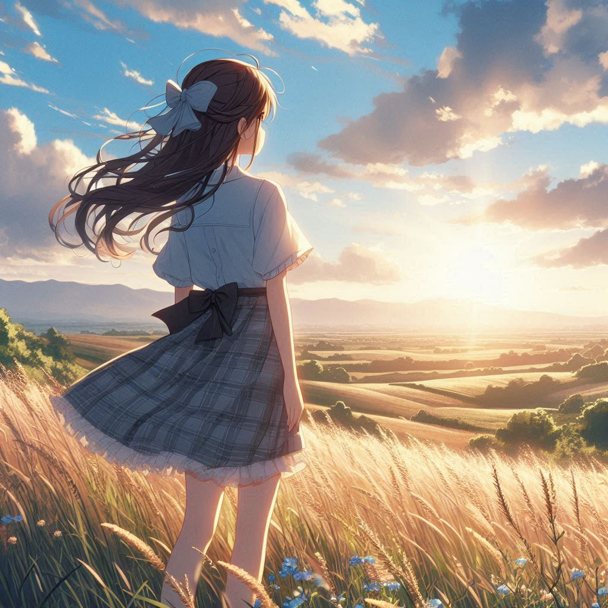
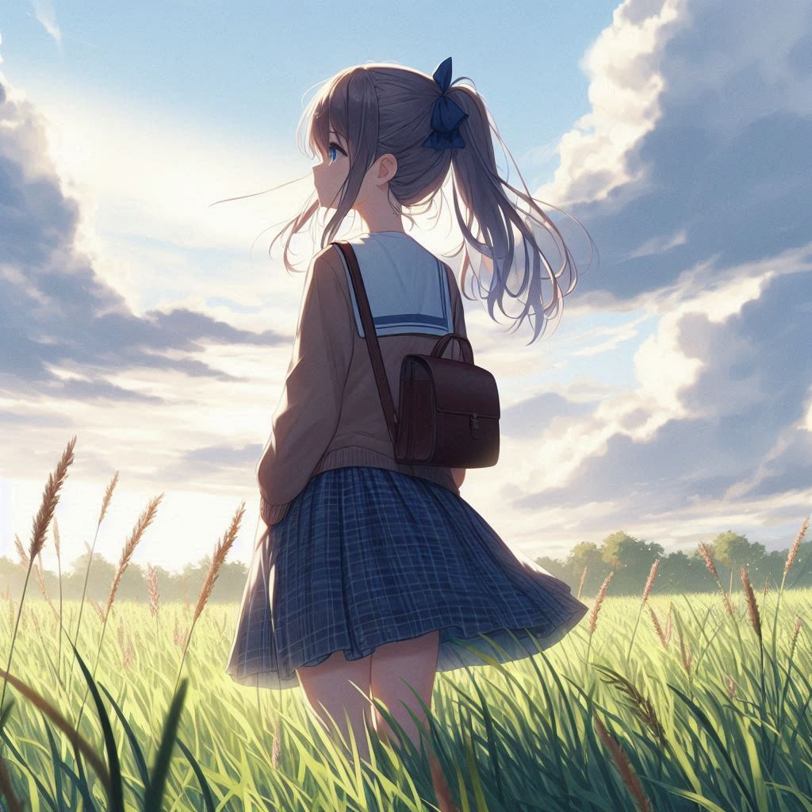
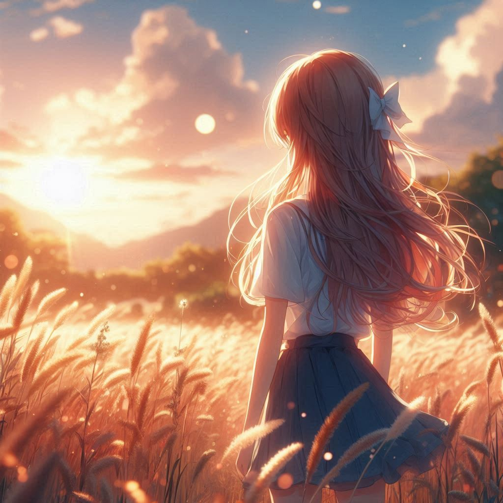
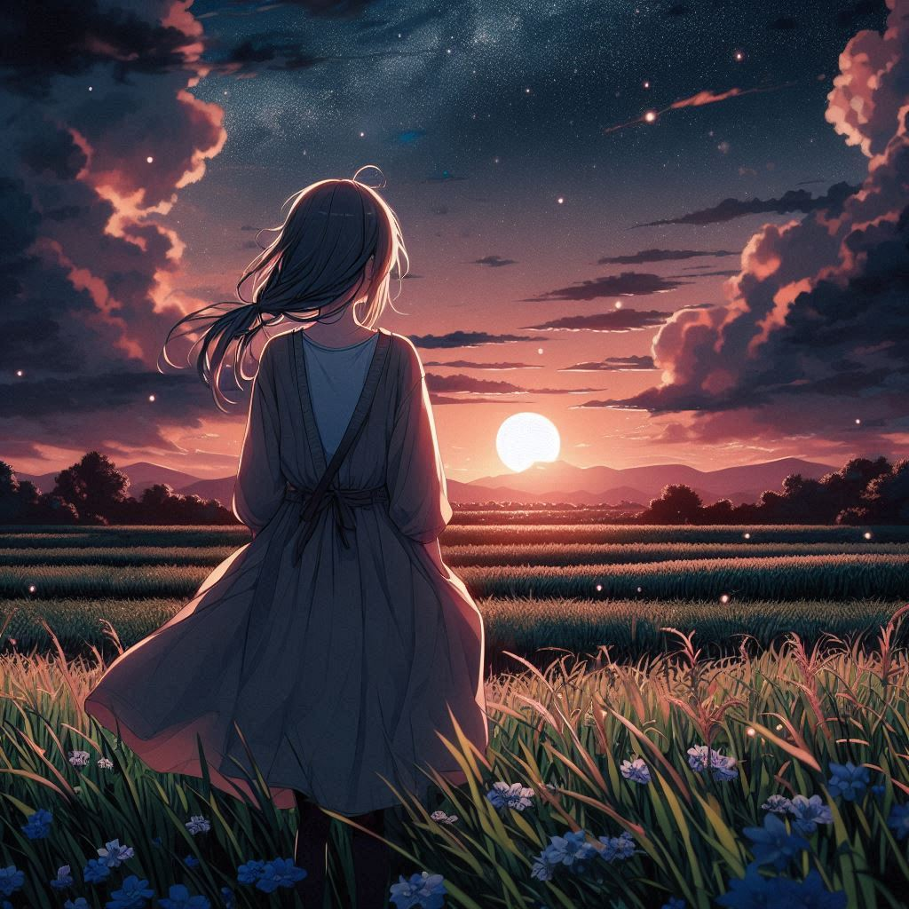

# The girl who leapt through time 
*while standing in distance

> [!NOTE]
> All prompts are tested in Copilot Designer
> 
> The prompts demonstrated here represent an introduction to time of day aesthetics, quality improvements will be demonstrated separately 

*anime art of a girl standing in distance, **sunrise, dappled sunrays***

*anime art of a girl standing in distance, **sunny, navy blue sky***

*anime art of a girl standing in distance, **sunny, dense bright clouds, navy blue sky***

*anime art of a girl standing in distance, **tree, dappled sunlight***

*anime art of a girl standing in distance, **afternoon, light blue sky***

*anime art of a girl standing in distance, **golden hour, bokeh***

*anime art of a girl standing in distance, **setting sun, clouds, dark night***

*anime art of a girl standing in distance, **sunset, dark night***

*anime art of a girl standing in distance, **twilight, stars***

*anime art of a girl standing in distance, **overcast weather, greenery***

*anime art of a girl standing in distance, **night, blue sky, long exposure shot***

*anime art of a girl standing in distance, **dark night, stars***
